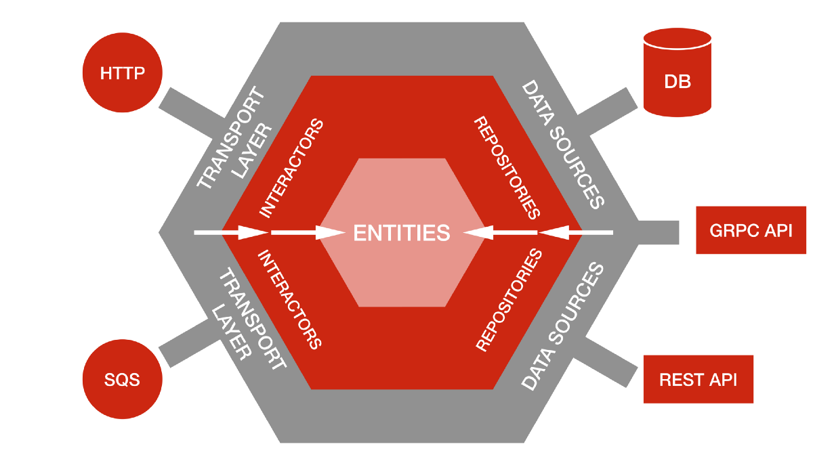
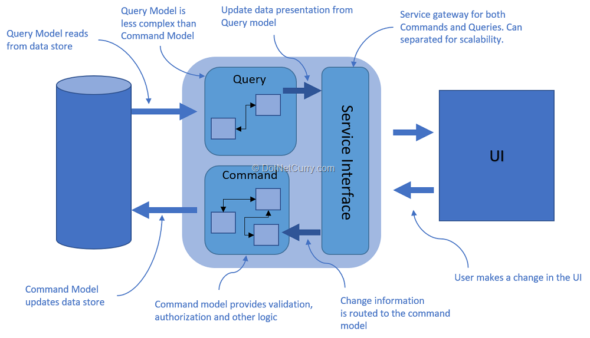

# Storing system company revenue

The project consumes information about the revenue of different companies, persists them and can be accessed afterwards.
The project can also aggregate all the revenues and get them back to you.
Accessible resources:

* 3 REST endpoints (swagger UI - http://localhost:8080/swagger-ui/):
    * GET `/api/companies/all` - Returns all the persisted company names and revenue value
      
      Example:

    ```json
    {
      "Company A": 10,
      "Company B": 100,
      "Company C": 50
    }
    ```
    * GET `/api/companies/sum"` - Retrieves the sum of all the stored revenues
      
      Example:
    ```json
    160
    ```
    * Post `/api/companies"` - Expects company details and stores them in the database

      Example:
    ```json
    {
      "name": "Company D",
      "value": 100
    }
    ```

* All of these endpoints can be tested on the swagger UI (http://localhost:8080/swagger-ui/ after you run the app), and you can find detailed descriptions.


## Installation

To build the project + run the tests, use the provided Maven scripts:
```   
./mvnw clean package
```
To build the project without running the tests, use the provided Maven scripts:
```   
./mvnw clean package -DskipTests
```
To run the project:
```
./mvnw spring-boot:run
```

* Have in mind - to run the service, or the tests you need a running instance of Postgres. You can easily start one with:
```
docker-compose -f docker-compose-for-testing.yml up
```

## Run tests

To run all the tests of the project:
```
./mvnw test
```

## Used technologies

* Java 11
* Spring Boot
* PostgreSQL
* Hibernate implementation of JPA
* Springfox (implementation of Swagger)


## Architecture
* I structured the code following the hexagonal architecture. This allows decoupled adapters from business logic. We can easily exchange the direction the data goes as long as it follows the provided ports.
The dependencies go from adapter layer (outside world) to domain (business logic), so the core application doesn't know what's happening with outgoing data and where data comes from.


  


* There is an CQS pattern hidden in the code as well. This gives us separation between getting data and pushing data. The benefit comes when the service grow and need to scale up. Usually GET requests are much more popular than posting/updating data, so if we follow a pattern like this during development, we can easily split the service in multiple microservices (Queries and Commands) and scale them up individually.

